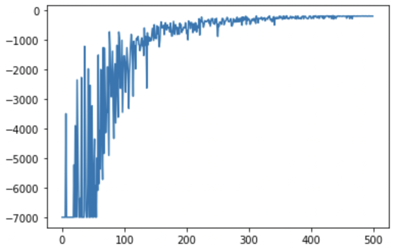
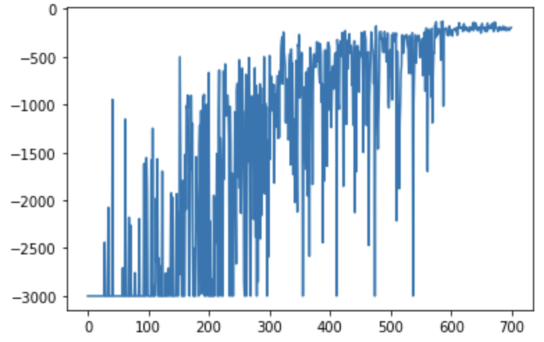
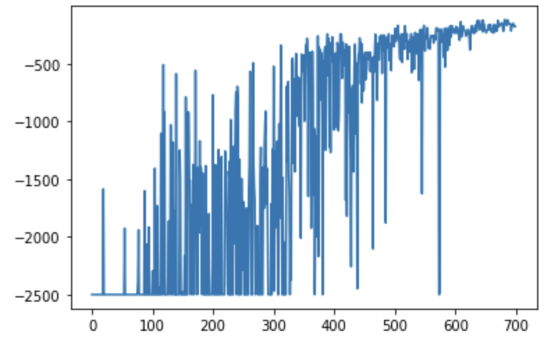
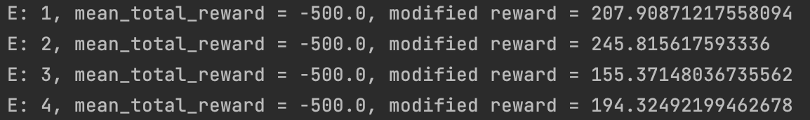
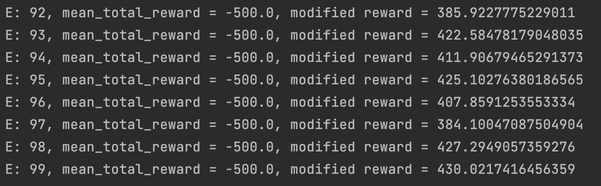

## Задание 3
#### Содержание
[Выбор среды](#выбор-среды) \
[Дискретизация пространства состояний](#Дискретизация-пространства-состояний)\
[Метод Monte-Carlo](#метод-Monte-Carlo)\
[Метод SARSA](#Метод-SARSA)\
[Метод Q-Learning](#Метод-Q-Learning)\
[Метод Deep Cross Entropy](#Метод-Deep-Cross-Entropy)

### Выбор среды
> В качестве среды для тестирования был выбран `MountainCar-v0` со снятым ограничением на макс. длину сессии.

### Дискретизация пространства состояний
> Состояние среды `MountainCar-v0` описывается 2-мерным вектором, где 1ая координата определяет позицию машинки (`от -1.2 до 0.6`), а 2ая - ее скорость (`от -0.07 до 0.07`)\
> Я поделил пространство позиции на `18` секторов длины `0.1`, а пространство скоростей на `14` промежутков по `0.01`\
> Получили: `18 * 14 = 252` состояния

### Метод Monte Carlo
Оптимальные параметры запуска:
```jupyterpython
episode_n=500
t_max=7000
gamma=0.99
```
Результат:



### Метод SARSA
Оптимальные параметры запуска:
```jupyterpython
episode_n=700
noisy_episode_n=600
t_max=3000
gamma=0.999
alpha=0.5
```
Результат:



### Метод Q Learning
Оптимальные параметры запуска:
```jupyterpython
episode_n=700
noisy_episode_n=600
t_max=2500
gamma=0.999
alpha=0.5
```
Результат:



### Метод Deep Cross Entropy
Данный метод показал себя плохо вне зависимости от параметров.
Вагонетка всегда находилась в игре всю длину сессии.

Модифицированнная награда позволила ей принимать решения в сторону ускорения...Однако результат по награде (штрафу) не улучшился

Результаты:


<hr>

