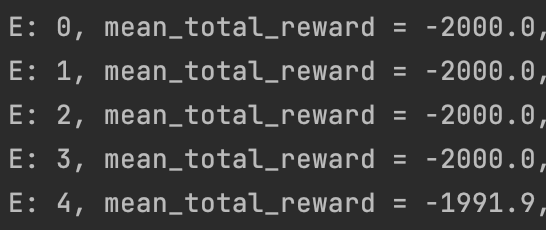
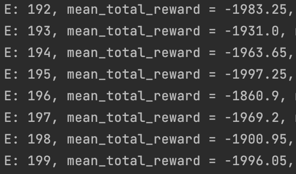
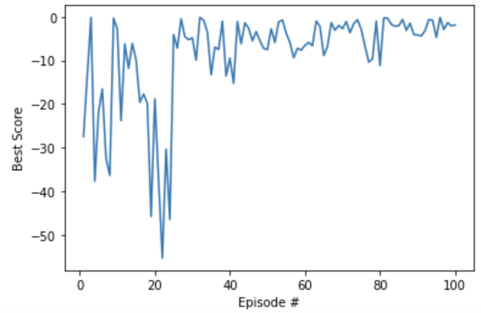
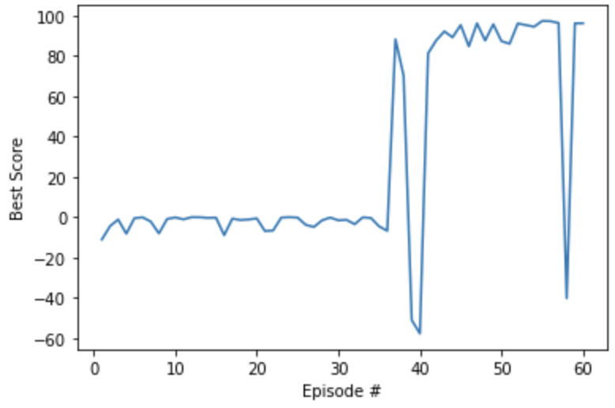
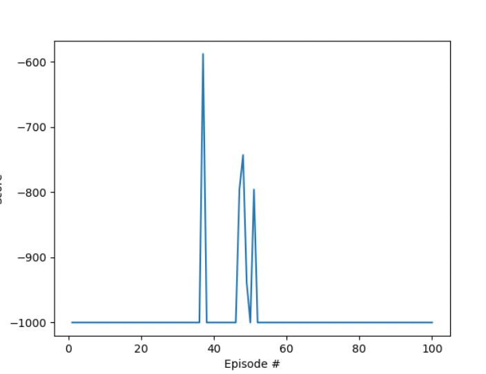
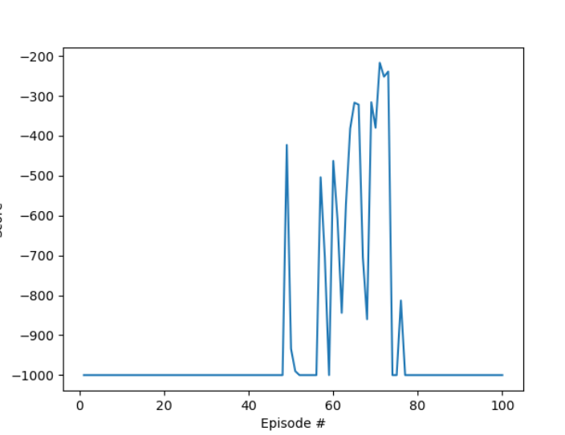
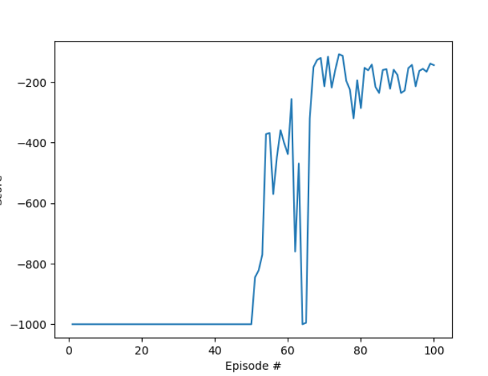

## Задание 4
#### Содержание
[Выбор среды](#выбор-среды) \
[Результаты Deep Cross Entropy](#Результаты-Deep-Cross-Entropy) \
[Результаты Deep Q Network](#Результаты-Deep-Q-Network)

### Выбор среды
> В качестве среды для тестирования был выбран `MountainCar-v0` со снятым ограничением на макс. длину сессии.

### Результаты Deep Cross Entropy
a. Версия из задания 3 не показала достойных результатов:\

b. Версия из задания 4 смогла найти успешную стратегию, 
однако для этого ей потребовалось несколько (десятков) запусков:\
Здесь результат в районе 0 из-за другой функции вычисления награды (0 здесь эквивалентен -t_max в варианте выше)

### Результаты Deep Q Network
Модель смогла обучиться (хоть и не до конца),
однако для этого ей тоже понадобилось n запусков. 

При этом возникали ситуации, когда модель двигалась с мертвой точки, но после снова ухудшала результаты.

